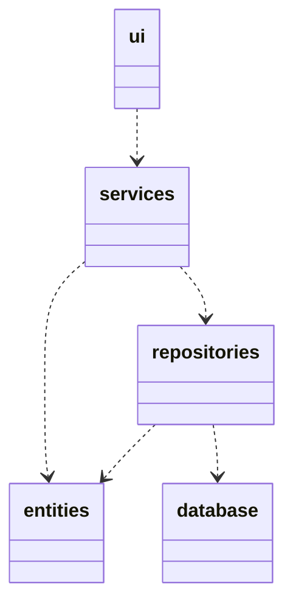
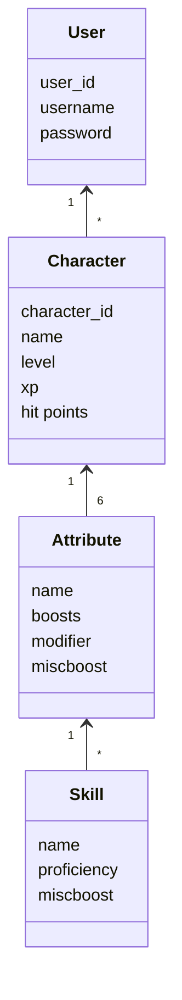
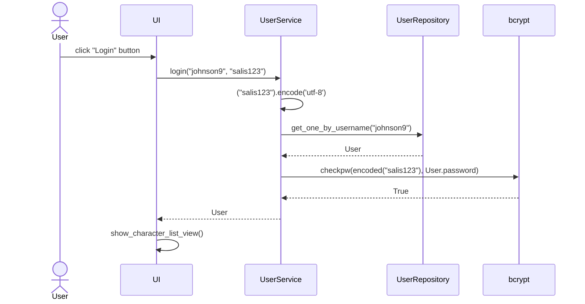

<h2>Sovelluksen pakkausrakenne</h2>

Koodi on jaettu niin, että _ui_ sisältää käyttöliittymää, _services_ sovelluslogiikkaa ja _repositories_ pysyväistallennusta vastaavan koodin. Pakkaus _database_ kuvastaa tiedostoja, jotka luovat yhteyden SQLite3-tietokantaan jota _repositories_ käyttää komennoissaan. Pakkaus _entities_ sisältää luokkia, jotka vastaavat tietokannassa olevia rivejä.

<h2>Sovelluslogiikka</h2>

Sovelluslogiikka koostuu luokista [User]https://github.com/Regularmute/ot-harjoitustyo/blob/main/src/entities/user.py, [Character](https://github.com/Regularmute/ot-harjoitustyo/blob/main/src/entities/character.py), Attribute sekä Skill. Tällä hetkellä vain ensimmäiset kaksi luokkaa on toteutettu, ja molemmilla on lisätty oma taulu SQLite3-tietokantaan.

Molemmilla luokilla on oma _service_-luokka pakkauksessa _services_, joka vastaa niiden toiminnallisista kokonaisuuksista.

* [UserService](https://github.com/Regularmute/ot-harjoitustyo/blob/main/src/services/user_service.py)
* [CharacterService](https://github.com/Regularmute/ot-harjoitustyo/blob/main/src/services/character_service.py)

Nämä luokat tarjoavat oman metodin jokaiselle käyttöliittymän toiminnolle, kuten hahmon rakentamiselle, sisäänkirjautumiselle tai hahmon nimen vaihtamiselle.

Nämä luokat pystyvät hakemaan ja tallettamaan tietoa käyttäjiin ja hahmoihin pakkauksen _repositories_ kautta, joka sisältää omat luokat molempien taulujen käsittelyä varten. Näiden _repository_-luokkien toteutus injektoidaan _service_-luokille jälkimmäisten konstruktiokutsujen yhteydessä.

* [UserRepository](https://github.com/Regularmute/ot-harjoitustyo/blob/main/src/repositories/user_repository.py)
* [CharacterRepository](https://github.com/Regularmute/ot-harjoitustyo/blob/main/src/repositories/character_repository.py)

Pakkauksen _repository_ luokkiin injektoidaan konstruktiokutsun yhteydessä yhteys tietokantaan moduulista [database_connection.py](https://github.com/Regularmute/ot-harjoitustyo/blob/main/src/database_connection.py), joka rakentaa yhteyden sovelluksen käynnistyessä ympäristömuuttujien tai [config-tiedoston](https://github.com/Regularmute/ot-harjoitustyo/blob/main/src/config.py) avulla.

<h2>Sekvenssikaavio sisäänkirjautumiselle</h2>

