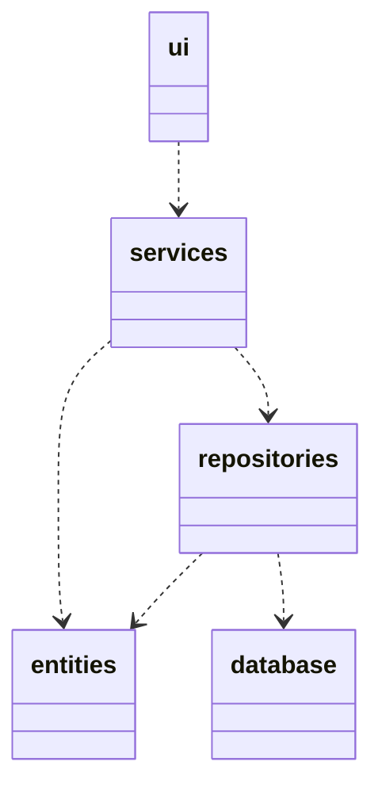
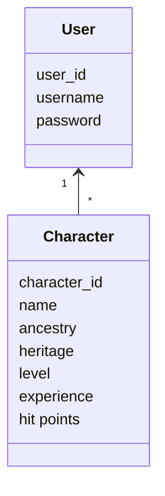
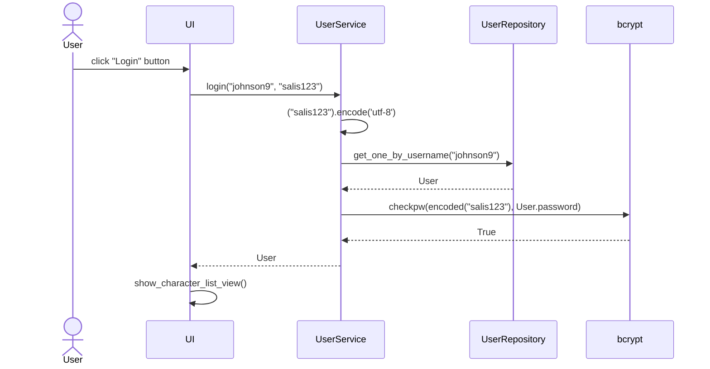

# Arkkitehtuurikuvaus

## Sovelluksen pakkausrakenne

Koodi on jaettu niin, että _ui_ sisältää käyttöliittymää, _services_ sovelluslogiikkaa ja _repositories_ pysyväistallennusta vastaavan koodin. Pakkaus _database_ kuvastaa tiedostoja, jotka luovat yhteyden SQLite3-tietokantaan jota _repositories_ käyttää komennoissaan. Pakkaus _entities_ sisältää luokkia, jotka vastaavat tietokannassa olevia rivejä.

## Käyttöliittymä

Käyttöliitymällä on seuraavat näkymät:

* Kirjautuminen
* Rekisteröityminen
* Hahmolista
* Yksittäisen hahmon tiedot

Käyttöliittymä on eristetty sovelluslogiikasta, ja sen näkymien näyttäminen tapahtuu UI-luokassa. Jokainen näkymä on toteutettu omana luokkanaan, ja vain yksi niistä on samaan aikaan näkyvissä. Eri näkymät sisältävät painikkeita, joiden klikkaaminen kutsuu Service-luokan metodeja.

Sekä hahmolistan että yksittäisen hahmon näkymät renderöivät näyttämäänsä tietoa sitä mukaa, kun käyttäjä luo tai poistaa uusia hahmoja tai muokkaa jonkun hahmon tietoja. Hahmolistanäkymästä kutsutaan sovelluksen metodia initialize_character_list, ja hahmon tietojen näkymästä kutsutaan muokattavasta kentästä riippuen esimerkiksi metodia initialize_name_field. Nämä metodit saavat sovelluslogiikalta päivittyneet tiedot, ja renderöivät näkymän uudelleen näiden tietojen perusteella.

## Sovelluslogiikka

Sovelluslogiikka koostuu luokista [User](https://github.com/Regularmute/ot-harjoitustyo/blob/main/src/entities/user.py) ja [Character](https://github.com/Regularmute/ot-harjoitustyo/blob/main/src/entities/character.py). Molemmille on lisätty oma taulu SQLite3-tietokantaan.

Molemmilla luokilla on oma _service_-luokka pakkauksessa _services_, joka vastaa niiden toiminnallisista kokonaisuuksista.

* [UserService](https://github.com/Regularmute/ot-harjoitustyo/blob/main/src/services/user_service.py)
* [CharacterService](https://github.com/Regularmute/ot-harjoitustyo/blob/main/src/services/character_service.py)

Nämä luokat tarjoavat oman metodin jokaiselle käyttöliittymän toiminnolle, kuten hahmon rakentamiselle, sisäänkirjautumiselle tai hahmon nimen vaihtamiselle.

Nämä luokat pystyvät hakemaan ja tallettamaan tietoa käyttäjiin ja hahmoihin pakkauksen _repositories_ kautta, joka sisältää omat luokat molempien taulujen käsittelyä varten. Näiden _repository_-luokkien toteutus injektoidaan _service_-luokille jälkimmäisten konstruktiokutsujen yhteydessä.

* [UserRepository](https://github.com/Regularmute/ot-harjoitustyo/blob/main/src/repositories/user_repository.py)
* [CharacterRepository](https://github.com/Regularmute/ot-harjoitustyo/blob/main/src/repositories/character_repository.py)

Pakkauksen _repository_ luokkiin injektoidaan konstruktiokutsun yhteydessä yhteys tietokantaan moduulista [database_connection.py](https://github.com/Regularmute/ot-harjoitustyo/blob/main/src/database_connection.py), joka rakentaa yhteyden sovelluksen käynnistyessä ympäristömuuttujien tai [config-tiedoston](https://github.com/Regularmute/ot-harjoitustyo/blob/main/src/config.py) avulla.

## Tietojen pysyväistallennus

Käyttäjien ja hahmojen tiedot tallennetaan SQLite3-relaatiotietokantaan. Sekä `UserRepository` että `CharacterRepository`-luokat tallentavat ja lukevat tietoa tietokannan tauluista `users` ja `characters`. Tämä tietokanta luodaan tai haetaan hakemistosta /data/, ja sen nimi määritetään .env tiedostossa ympäristömuuttujan avulla. Jos ympäristömuuttujaa ei ole määritetty, komento `poetry run invoke create-database` luo tietokannan nimeltä "database.sqlite".

Käyttäjien tietokantataulu "users" sisältää seuraavat sarakkeet: user_id, username sekä password. User_id toimii samalla jokaisen käyttäjärivin yksilöllisenä tunnisteena, joka määritetään automaattisesti riville kun se lisätään ensimmäistä kertaa tauluun. Username on merkkijono, jolla käyttäjä kirjautuu sisään ja tunnistaa itsensä. Password on bcryptin avulla salattu ja suolattu salasana, jota käyttäjä käytyy kirjautumiseen. Koska salasanoja ei tallenneta tietokantaan sellaisenaan, sovelluslogiikka käyttää bcryptin checkpw()-metodia käyttäjän kirjautumisen tarkistamiseksi.

Hahmojen tietokantataulu "characters" sisältää seuraavat sarakkeet: character_id, creator_id, name, ancestry, heritage, level, experience ja hit_points. Suuri osa sarakkeista edustaa Pathfinder2-pelin sääntöihin perustuvia hahmojen ominaisuuksia. Character_id on hahmojen yksilöllinen tunnisteluku, kuten user_id "users"-taulukossa, ja se asetetaan hahmolle sen luomisen yhteydessä. Samoin kuin käyttäjien suhteen, character_id ei ole pakollinen parametri Character-entiteetille, sillä se asetetaan vasta SQL-taulun puolella. Creator_id viittaa hahmon luoneen käyttäjän "user_id":seen, joka saadaan tarkistamalla kirjautuneen käyttäjän tunnisteluku hahmon luonnin yhteydessä. Name, ancestry ja heritage ovat kaikki merkkijonoja, jotka kuvaavat pelin hahmoa ja vaikuttavat pelin sisäisiin vaihtoehtohin. Level, experience ja hit_points ovat numeroita, jotka myös toimivat osana Pathfinder-pelin sääntöjä.

### Testien tallennus

Repository-luokkien testit tallentavat ja käsittelevät tietoa erillisestä testitietokannasta, jonka nimi on määritelty .env.test tiedostossa. Sovelluslogiikkaa testaavat Service-testit säilövät tietoa tietokannan sijasta keskusmuistiin testitiedostoissa määritellyn "FakeRepository"-luokan avulla. Integraatiotestit käyttävät samaa testitietokantaa kuin Repository-luokat. Nämä tietokannat tyhjennetään jokaisen testikerran alussa.

### Tiedostot

Sovellus tallentaa käyttäjien ja hahmojen tiedot .sqlite-tiedostoon. Käytettävän tiedoston nimi voidaan määrittää ympäristömuuttujaan .env-tiedostossa. Ilman erillisiä ympäristömuuttujia, varsinainen sovellus tallentaa tiedot data/database.sqlite tiedostoon, ja testit data/test-database.sqlite tiedostoon.

## Päätoiminnallisuudet

Kuvataan muutamaa päätoimintoa sekvenssikaavioiden avulla.

### Sisäänkirjautuminen

Sovelluksen kirjautumisnäkymän kirjoituskenttiin kirjoitetaan tunnuksen käyttäjätunnus ja salasana, jonka jälkeen klikataan "Login"-painiketta. Sitten sovelluksen kontrolli etenee seuraavalla tavalla:

Painikkeen painamiseen reagoiva tapahtumankäsittelijä kutsuu UserService-luokasta "login"-funktiota, jolle annetaan parametriksi näkymän syötekenttien sisältämät tekstit. Tämä funktio enkoodaa annetun salasanan utf-8 muotoon, jotta bcrypt-kirjasto pystyy käsittelemään sitä oikein.

UserService-olio kutsuu UserRepositoryltä funktiota "get_one_by_username", joka suorittaa Repositorio-olioon liitetylle tietokantayhteydelle SQL-kyselyn, mikä palauttaa käyttäjänimeä vastaavan User-entiteetin, joka sisältää myös salatun version käyttäjän salasanasta.

Jos käyttäjänimeä vastaavaa riviä ei löydy tietokannasta, tai jos bcryptin checkpw-metodi toteaa että kirjautumiseen käytetty salasana ei vastaa palautetun entiteetin salattua salasanaa, nostetaan virhe. Kaaviossa kuitenkin oletamme kirjautumisen onnistuvan, jolloin palautettu käyttäjä asetetaan kirjautuneeksi käyttäjäksi, ja palautetaan käyttöliittymälle. Lopulta käyttöliittymä siirtyy hahmolistanäkymään, joka sisältää kirjautuneen käyttäjän hahmot.

### Muut toiminnallisuudet

Sovelluksen kaikki toiminnallisuudet noudattavat samaa periaatetta. Käyttöliittymä kutsuu tapahtumankäsittelijältä sovelluslogiikalta jotakin metodia, ja sovelluslogiikka päivittää kirjautuneen käyttäjän, hahmolistan tai yksittäisen hahmon tilaa. Tämän jälkeen käyttöliittymä päivittää aktiivisen näkymän vastaavan logiikan päivittämää tilaa.
