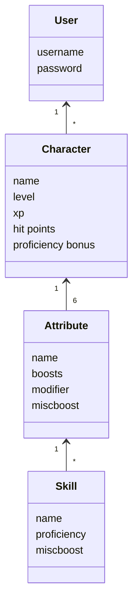

```mermaid
  classDiagram
    User "1" <-- "*" Character
    Character "1" <-- "6" Attribute
    Attribute "1" <-- "*" Skill
    class User{
      username
      password
    }
    class Character{
      name
      level
      xp
      hit points
      proficiency bonus
    }
    class Attribute{
      name
      boosts
      modifier
      miscboost
    }
    class Skill{
      name
      proficiency
      miscboost
    }
```