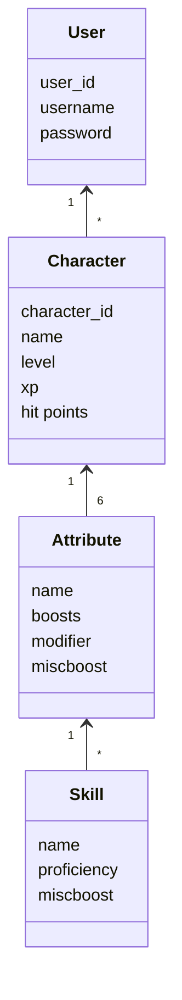
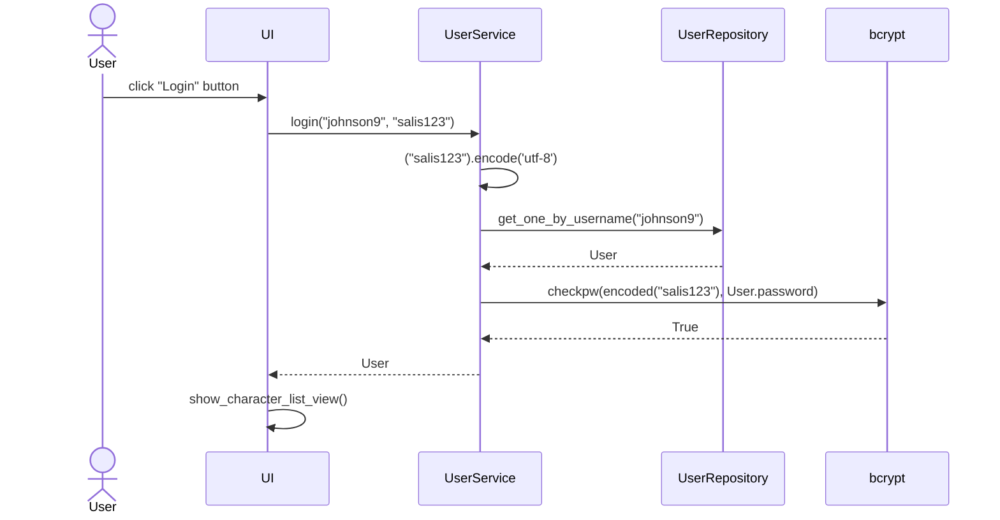

<h2>Class diagram for stored entities</h2>

```mermaid
  classDiagram
    User "1" <-- "*" Character
    Character "1" <-- "6" Attribute
    Attribute "1" <-- "*" Skill
    class User{
      user_id
      username
      password
    }
    class Character{
      character_id
      name
      level
      xp
      hit points
    }
    class Attribute{
      name
      boosts
      modifier
      miscboost
    }
    class Skill{
      name
      proficiency
      miscboost
    }
```

<h2>Sequence diagram for logging in</h2>

```mermaid
  sequenceDiagram
  actor User
  participant UI
  participant UserService
  participant UserRepository
  User->>UI: click "Login" button
  UI->>UserService: login("johnson9", "salis123")
  UserService->>UserService: ("salis123").encode('utf-8')
  UserService->>UserRepository: get_one_by_username("johnson9")
  UserRepository-->>UserService: User
  UserService->>bcrypt:checkpw(encoded("salis123"), User.password)
  bcrypt-->>UserService: True
  UserService-->>UI: User
  UI->>UI:show_character_list_view()
```
