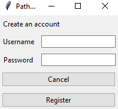
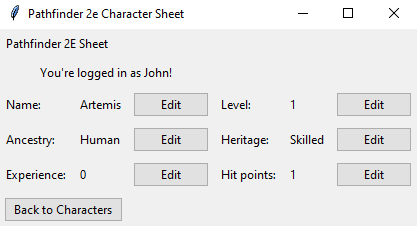

# Käyttöohje
Etsi projektin [releaseista](https://github.com/Regularmute/ot-harjoitustyo/releases) viimeisin versio, ja lataa sieltä _Assets_-osion alta _Source code_ koneellesi sopivassa muodossa.

## Kirjautuminen
Sovellus aukeaa kirjautumisnäkymässä:

Voit kirjautua sisään kirjoittamalla olemassaolevan käyttäjätunnuksen ja sitä vastaavan salasanan syötekenttiin ja painamalla "Login"-painiketta. Jos sinulla ei ole tunnusta, voit luoda uuden tunnuksen painamalla "Register"-painiketta.

## Uuden tunnuksen luominen
Painamalla kirjautumisnäkymän "Register"-painiketta päädyt rekisteröintinäkymälle:

Voit palata takaisin kirjautumisnäkymään painamalla "Cancel"-painiketta. Voit luoda uuden käyttäjän kirjoittamalla tiedot niitä vastaaviin syötekenttiin ja painamalla "Register"-painiketta. Jos tietokannassa on jo toinen samanniminen käyttäjätunnus, näet virheilmoituksen ja voit yrittää luoda toisen tunnuksen eri nimellä.

Jos rekisteröinti onnistuu, sinut kirjataan sisään automaattisesti ja päädyt hahmolistanäkymään.

## Uuden hahmon luominen
Uudella käyttäjätunnuksella ei näy olemassaolevia hahmoja:

.PNG)

Voit luoda uuden hahmon kirjoittamalla sen nimen syötekenttään, ja painamalla "Create"-painiketta. Voit vaihtaa hahmon nimen myöhemmin.

## Olemassaolevan hahmon muokkaaminen
Jos tunnuksella on olemassa hahmoja, ne näkyvät hahmolistanäkymässä:

.PNG)

Painamalla tietyn hahmon kohdalla olevaa "View"-painiketta, pääset hahmolomakesivulle:

Täällä näet hahmosi tiedot, ja voit muokata niitä painamalla "Edit"-painiketta. Tallenna muutoksesi painamalla muokatessa näkyvää "Confirm"-painiketta.

Pääset takaisin hahmolistanäkymään painamalla "Back to Characters"-painiketta.

## Uloskirjautuminen
Paina hahmolistanäkymässä "Logout"-painiketta kirjautuaksesi ulos. Muista aina kirjautua ulos kun lopetat sovelluksen käytön!
