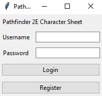

# Käyttöohje
Etsi projektin [releaseista](https://github.com/Regularmute/ot-harjoitustyo/releases) viimeisin versio, ja lataa sieltä _Assets_-osion alta _Source code_ koneellesi sopivassa muodossa.

## Kirjautuminen
Sovellus aukeaa kirjautumisnäkymässä:



Voit kirjautua sisään kirjoittamalla olemassaolevan käyttäjätunnuksen ja sitä vastaavan salasanan syötekenttiin ja painamalla "Login"-painiketta. Jos sinulla ei ole tunnusta, voit luoda uuden tunnuksen painamalla "Register"-painiketta.

## Uuden tunnuksen luominen
Painamalla kirjautumisnäkymän "Register"-painiketta päädyt rekisteröintinäkymälle:


Voit palata takaisin kirjautumisnäkymään painamalla "Cancel"-painiketta. Voit luoda uuden käyttäjän kirjoittamalla tiedot niitä vastaaviin syötekenttiin ja painamalla "Register"-painiketta. Jos tietokannassa on jo toinen samanniminen käyttäjätunnus, näet virheilmoituksen ja voit yrittää luoda toisen tunnuksen eri nimellä.

Jos rekisteröinti onnistuu, sinut kirjataan sisään automaattisesti ja päädyt hahmolistanäkymään.

## Uuden hahmon luominen
Uudella käyttäjätunnuksella ei näy olemassaolevia hahmoja:

.PNG)

Voit luoda uuden hahmon kirjoittamalla sen nimen syötekenttään, ja painamalla "Create"-painiketta. Voit vaihtaa hahmon nimen myöhemmin.

## Olemassaolevan hahmon muokkaaminen
Jos tunnuksella on olemassa hahmoja, ne näkyvät hahmolistanäkymässä:

.PNG)

Painamalla tietyn hahmon kohdalla olevaa "View"-painiketta, pääset hahmolomakesivulle:


Täällä näet hahmosi tiedot, ja voit muokata niitä painamalla vastaavaa "Edit"-painiketta. Tallenna muutoksesi painamalla muokatessa näkyvää "Confirm"-painiketta.

Pääset takaisin hahmolistanäkymään painamalla "Back to Characters"-painiketta.

## Hahmon poistaminen
**HUOM: Poistettua hahmoa ei pysty palauttamaan millään tavalla!**

Hahmolistanäkymässä voit poistaa haluamasi hahmon painamalla "Delete"-painiketta hahmon kohdalta. Vahinkopoistojen ehkäisemiseksi sovellus pyytää sinulta vahvistuksen:


Painamalla "No"-painiketta poisto keskeytyy, ja painamalla "Yes"-painiketta hahmolomakkeesi poistuu tietokannasta.

## Uloskirjautuminen
Paina hahmolistanäkymässä "Logout"-painiketta kirjautuaksesi ulos. Muista aina kirjautua ulos kun lopetat sovelluksen käytön!

## Virheistä
Jos syötät virheellisen syötteen, esimerkiksi kirjaimia numeraaliseen kenttään (level, experience, hit points), sovellus estää toiminnon ja näyttää sinulle virheviestin lomakkeen pohjalla punaisella. Virheviesti katoaa, kun suoritat onnistuneen muutostoiminnon, tai kun poistut lomakenäkymästä.

1.PNG)

## Konfigurointi
Halutessasi voit luoda sovelluksen juurihakemistoon .env tiedoston, johon voit määritellä haluamasi .sqlite-päätteisen tietokantatiedoston, jota sovellus käyttää. Sovellus tunnistaa oletusarvoisesti tiedoston nimeltä "database.sqlite", mutta voit muokata tunnistettavan tiedoston nimeä kirjoittamalla .env-tiedostoon seuraavan rivin (sijoita haluamasi tiedostonimi ilman aaltosulkuja):

```
DATABASE_FILENAME={sinun_tiedoston_nimi}
```

Muista sijoittaa käyttämäsi tietokantatiedosto hakemiston /data sisälle. Tällä tavalla voit käyttää samaa tietokantaa usealla koneella!
