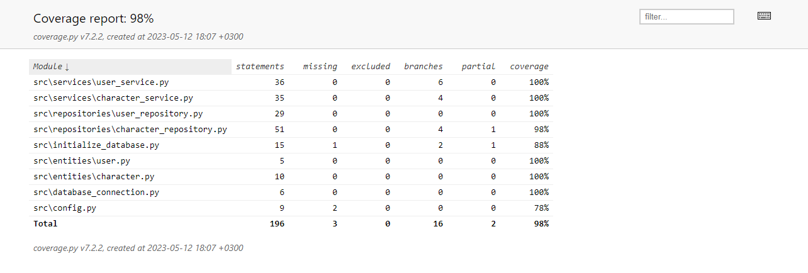

# Testaus

Ohjelmaa on testattu automaattisilla yksikkötesteillä ja integraatiotesteillä unittestillä sekä manuaalisesti järjestelmätasolla.

## Yksikkö- ja integraatiotestaus

### Repositorioluokat

Tietokantoja käsittelevät `UserRepository` sekä `CharacterRepository`-luokat testataan erillisen tietokantatiedoston avulla, joka on määritelty .env.test-tiedostossa. Nämä testiluokat ovat [TestUserRepository](https://github.com/Regularmute/ot-harjoitustyo/blob/main/src/tests/repositories/user_repository_test.py) sekä [TestCharacterRepository](https://github.com/Regularmute/ot-harjoitustyo/blob/main/src/tests/repositories/character_repository_test.py).

### Sovelluslogiikka

Sovelluslogiikasta vastaavat `UserService` sekä `CharacterService`-luokat testataan injektoimalla niiden olioihin repositorio-oliot `FakeUserRepository` ja `FakeCharacterRepository`-luokista, jotka simuloivat aitojen repositoriluokkien toimintaa muistissa tietokannan käsittelyn sijaan. Näin yksikkötestit tarkistavat pelkästään sovelluslogiikan toimintaa. Sovelluslogiikka-luokkien testit löytyvät luokista [TestUserService](https://github.com/Regularmute/ot-harjoitustyo/blob/main/src/tests/services/user_service_test.py) sekä [TestCharacterService](https://github.com/Regularmute/ot-harjoitustyo/blob/main/src/tests/services/user_service_test.py).

Integraatiotestit muistuttavat sovelluslogiikan yksikkötestejä, mutta näissä testeissä sovelluslogiikka käyttää oikeita repositorioluokkia (ks. ylemmät linkit kohdassa Repositorioluokat), jolloin saamme tarkistettua sovelluslogiikan ja repositorio-luokkien yhteistoiminnan. Integraatiotestien luokat ovat [TestUserIntegration](https://github.com/Regularmute/ot-harjoitustyo/blob/main/src/tests/integration/user_integration_test.py) sekä [TestCharacterIntegration](https://github.com/Regularmute/ot-harjoitustyo/blob/main/src/tests/integration/character_integration_test.py).

### Testauskattavuus

Käyttöliittymäkerrosta lukuunottamatta sovelluksen testihaaraumakattavuus on 98%:

Testauksen ulkopuolelle jäi eri ympäristömuuttujien asetus sekä tietokannan alustus komentoriviltä.

## Järjestelmätestaus

Sovellus on järjestelmätestattu manuaalisesti.

### Asennus ja konfigurointi

Sovellus on ladattu ja testattu [käyttöohjeen](https://github.com/Regularmute/ot-harjoitustyo/blob/main/dokumentaatio/kayttoohje.md) ohjaamalla tavalla sekä macOS-, Linux- että Windows-ympäristössä. Huomaa, että Windows-ympäristössä poetry komennot eivät toimi, vaan komennot täytyy suorittaa manuaalisesti. Nämä alkuperäiset komennot löytyvät tiedostosta [tasks.py](https://github.com/Regularmute/ot-harjoitustyo/blob/main/tasks.py).

Sovellusta on testattu sekä olemassaolevien tietokantatiedostojen kanssa että ilman, jolloin sovellus luo sen itse.

### Toiminnallisuudet

Kaikki [määrittelydokumentissa](https://github.com/Regularmute/ot-harjoitustyo/blob/main/dokumentaatio/vaatimusmaarittely.md) ja [käyttöohjeen](https://github.com/Regularmute/ot-harjoitustyo/blob/main/dokumentaatio/kayttoohje.md) määrittelemät toiminnallisuudet on käyty läpi. Myös virhetilanteita on kokeiltu esimerkiksi täyttämällä hahmon muokkauskentät välilyönneillä, tyhjillä arvoilla tai numeraalisten kenttien tapauksessa kirjaimilla.

### Jäljelle jääneet puutteet

* Pylint ilmoittaa puutteesta, että Character-entiteetti käyttää liian monta argumenttia. En keksinyt tapaa vähentää tätä, sillä hahmo säilöö nämä tiedot tietokannan sarakkeisiin, eikä niitä voi loogisesti laskea muuten.
