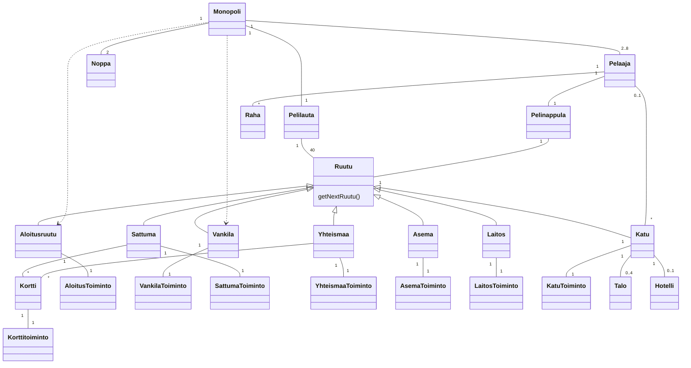

```mermaid
  classDiagram
    Monopoli "1"--"2..8" Pelaaja
    Monopoli "1"--"2" Noppa
    Monopoli "1"--"1" Pelilauta
    Pelaaja "1" -- "1" Pelinappula
    Pelilauta "1" -- "40" Ruutu
    Pelinappula "1" -- "1" Ruutu
    class Ruutu{
      getNextRuutu()
    }

    Ruutu <|-- Aloitusruutu
    Ruutu <|-- Vankila
    Ruutu <|-- Sattuma
    Ruutu <|-- Yhteismaa
    Ruutu <|-- Asema
    Ruutu <|-- Laitos
    Ruutu <|-- Katu

    Monopoli ..> Aloitusruutu
    Monopoli ..> Vankila

    Sattuma -- "*" Kortti
    Yhteismaa -- "*" Kortti

    Kortti "1" -- "1" Korttitoiminto

    Aloitusruutu "1" -- "1" AloitusToiminto
    Vankila "1" -- "1" VankilaToiminto
    Sattuma "1" -- "1" SattumaToiminto
    Yhteismaa "1" -- "1" YhteismaaToiminto
    Asema "1" -- "1" AsemaToiminto
    Laitos "1" -- "1" LaitosToiminto
    Katu "1" -- "1" KatuToiminto

    Katu "1" -- "0..4" Talo
    Katu "1" -- "0..1" Hotelli
    Katu "*" -- "0..1" Pelaaja

    Pelaaja "1" -- "*" Raha
```