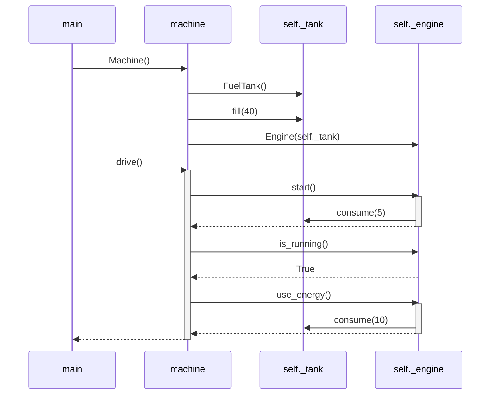

```mermaid
  sequenceDiagram
    main ->> machine: Machine()
    machine ->> self._tank: FuelTank()
    machine ->> self._tank: fill(40)
    machine ->> self._engine: Engine(self._tank)

    main ->> machine: drive()
    activate machine
    machine ->> self._engine: start()
    activate self._engine
    self._engine ->> self._tank: consume(5)
    self._engine -->> machine: 
    deactivate self._engine
    machine ->> self._engine: is_running()
    self._engine -->> machine: True

    machine ->> self._engine: use_energy()
    activate self._engine
    self._engine ->> self._tank: consume(10)
    self._engine -->> machine: 
    deactivate self._engine
    machine -->> main: 
    deactivate machine
```